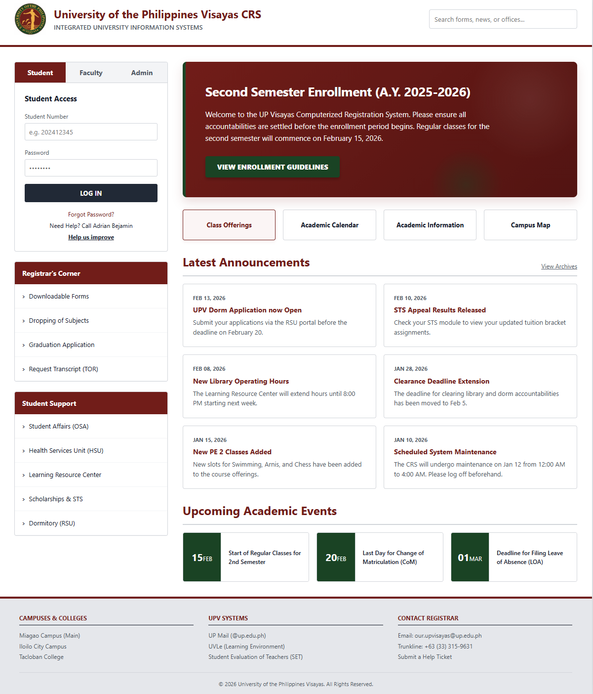
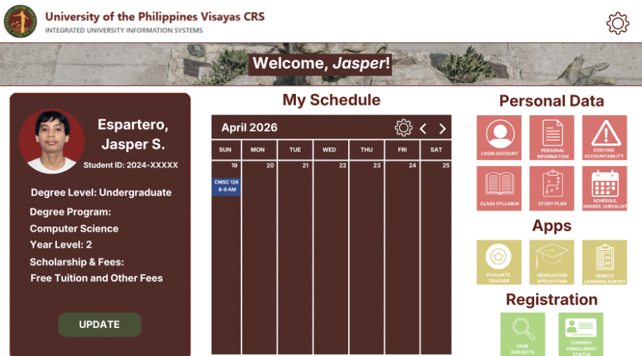
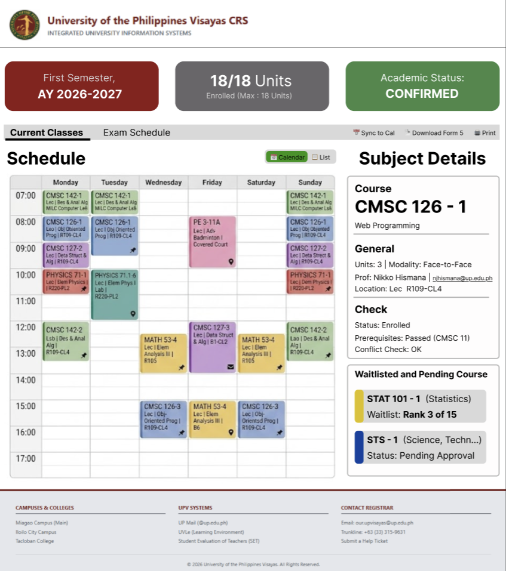
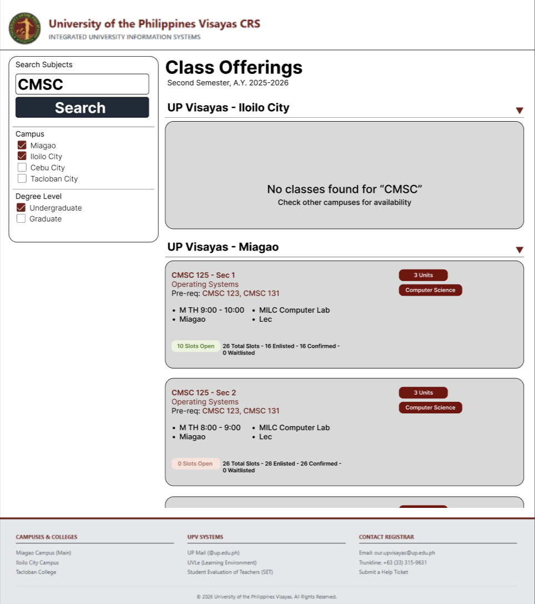

# UPV CRS 2.0 - Pitch Proposal

## A. System Summary

**Team Members:**
* Ralph Ryan Escabarte
* Jasper Espartero
* John Matthew Fallarme
* John Dave Valentin

Our proposed vision for the UPV CRS 2.0 focuses on modernizing the user experience, improving performance, and organizing data efficiently. Key features include:

* **Homepage Emphasis:** By having an actual homepage, CRS 2.0 will be much more welcoming and pleasing to the intended users. Providing photos of the University will give clarity to visitors on what to expect when visiting the institution.
* **Organized Categorization:** Properly segregated by requests based on purpose and hierarchy. Important elements are prioritized to be noticed first, followed by their subcategories if navigation is needed.
* **Broadcast System:** Shows important upcoming events that students and faculty must be aware of.
* **Font Hierarchy:** Includes varying font sizes and font emphasis to retain user attention and guide the desired heatmap of eye-track sensing.
* **Searchbar Navigation:** Included a searchbar to easily navigate through and request specific data or act as a connector to what is needed by the user.
* **Legacy Portal:** The old structure and positioning of the login-system for students, faculty, and admin will be implemented in the 2.0 to provide a familiar layout for old users.
* **Decluttered Contact Information:** Gave ample space for each contact information to stand on its own for users to smoothly navigate through.
* **Multi-View Toggle:** On the schedule page, students can choose between a calendar view or a list view.
* **Course Details:** When a student clicks a subject on the calendar or the list view, full details of the course will appear on the side.
* **Smart Features:** Students can now see the date of exams for each subject. The system prompts a warning if there is a conflict with a subject (helpful when enlisting) and provides a real-time list of the student's rank if they are waitlisted.
* **Export Tools:** Students can sync their calendar with a button to automatically export their schedule to Google Calendar or Apple Calendar.
* **Card Style Class Offerings:** The old UI is filled with too much dead space, which makes reading class offerings difficult. The new UI fixes this issue by grouping all the information into single, easy-to-read cards.

---

## B. Tech Stack

### I. Frontend Tools
* **Framework: React.js (via Next.js)**
  Regular React apps can be slow to load initially because the browser has to do all the work. Next.js prepares the page on the server first. This means the login page and dashboard appear instantly, which is critical when every second counts during enlistment.
* **Styling: Tailwind CSS**
  It allows you to build a custom, branded look faster than traditional CSS. It also ensures the site is responsive, meaning it will look perfect on both a 27-inch monitor and a 5-inch smartphone screen.
* **State Management: TanStack Query (React Query)**
  It handles background fetching and caching, ensuring that when a student clicks "Enlist," they are seeing the most recent data without manual refreshes.
* **Real-time Communication: WebSockets (Socket.io)**
  Used to push "Live Seat Counts" to the UI. Students can see the real-time slots available without refreshing the website.

### II. Backend Tools
* **Primary Language: Node.js**
  During enlistment, a massive amount of students access the website simultaneously. Node.js can handle these high-concurrency situations and process multiple logins at the same time without freezing.
* **API Architecture: GraphQL**
  This is highly efficient when a student only wants to access very specific data (like a single grade or schedule slot) without downloading their entire profile.

### III. Database
* **Database: Firebase**
  Acts as the central nervous system of the platform. It uses **Firestore** for storing flexible student records and academic history, and the **Realtime Database** for "Live Seat Counts." This ensures that when a slot opens up in a high-demand GE course, the change is broadcasted to every student's screen instantly without requiring a page refresh.

### IV. Other Tools
* **Firebase Authentication:** Handles the "Legacy Portal" login logic securely. It supports Single Sign-On (SSO) via UP Mail (@up.edu.ph), making the transition to 2.0 seamless while maintaining high-level security.
* **Cloud Functions:** Used for serverless background tasks, such as automatically calculating a student's GWA or triggering "Account Cleared" notifications once a library accountability is settled.
* **Firebase Cloud Storage:** A dedicated space for digital document submissions. Students can upload their Form 5, Medical Certificates, or ID photos directly, keeping the main database light and fast.
* **Zod:** A validation tool that acts as a "gatekeeper" for data. It ensures that every input, like a student number or course code, is formatted correctly before it's saved, preventing system errors caused by typos.

---

## C. Hosting

* **Platform: Firebase Hosting**
  A production-grade hosting service that delivers the CRS 2.0 via a Global CDN (Content Delivery Network). This means the website assets are stored on servers physically close to the user, ensuring the dashboard feels "app-like" and snappy even during the high-latency periods of peak enrollment week. It also provides automatic SSL encryption to keep student data private and secure.

---

## D. Mockups

### 1. Homepage

### 2. Student Page Dashboard

### 3. Schedule / Conflict Check Screen

### 4. Class Offerings / Enlistment Search
